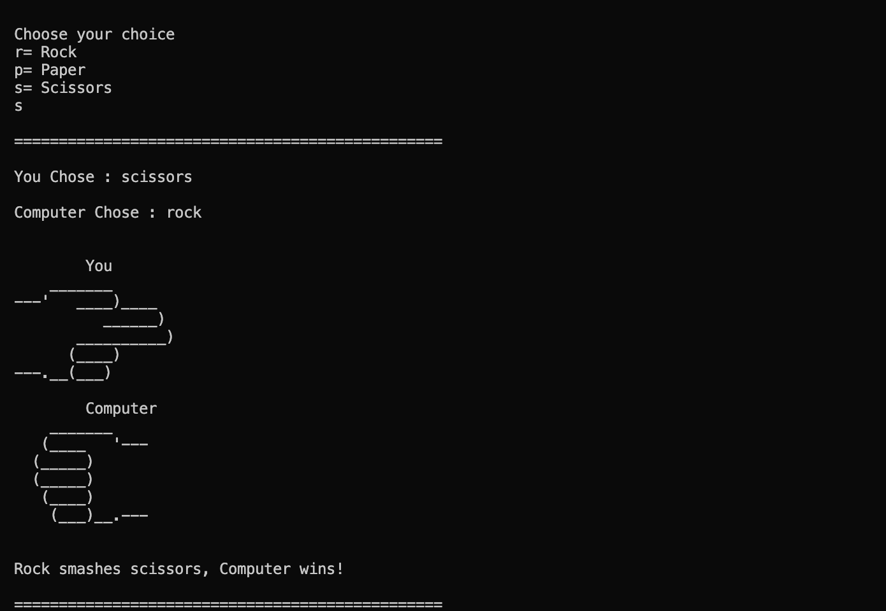

# Rock, Paper and Scissors

This is a basic terminal-based project developed in Python.



## Setup

1. To run the project, you need to have Python installed on your computer.

2. Clone the repository to your local machine.
   ```sh
   git clone https://github.com/murali-cse/rock_paper_scissors.git
   ```
3. Navigate to the `rock_paper_scissors` directory and run the `rock_paper_scissors.py` file.
   ```python
   python3 rock_paper_scissors.py
   ```
4. Have a fun 🎉
